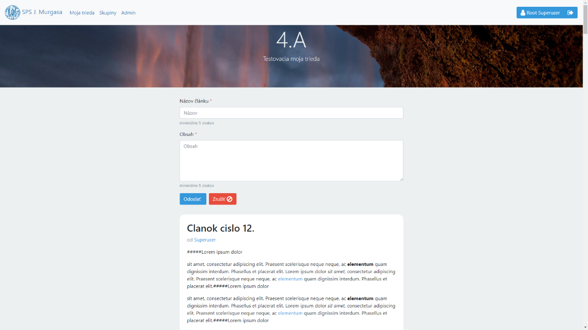

# Triedna sociálna sieť

Triedna sociálna sieť je platforma pre študentov, kde môžu zdielať novinky medzi sebou, komunikovať a spolupracovať.

Pôvodným zámerom bolo vytvoriť službu, ktorá by integrovala školskú jedáleň, edupage a prvky sociálnej siete. Po
absolvovaní strednej školy som ukončil vývoj projektu.

## Motivácia

Pôvodným zámerom bolo vytvoriť službu, ktorá by integrovala školskú jedáleň, edupage a prvky sociálnej siete. Podarilo sa mi naimplementovať len sociálnu sieť, lebo mi nezvýšil čas na implementáciu spoľahlivého web scrapera. Web scraper by spracovával dáta z jedálne a z edupagu.

## Funkcionalita

- autentifikácia je vykonávaná na strane Googlu pomocou OAuth2 protokolu

- pomocou OAuth2 dokážem zistiť, kto môže používať službu
  (za podmienky, že škola má Gmail emaily)

- obsah sa načitáva, keď ho užívateľ potrebuje. K sťahovaniu dochádza, keď užívateľ sa blíži na spodok stránky

- používatelia môžu využívať markdown na formátovanie príspevkov a komentárov

- obsah je syncrhonizovaný so serverom. Projekt na syhcronizáciu používa Websockety

- používateľ môžu pristupovať k dátam pomocou REST API (pravdaže, ak má práva na dáta, ku ktorým sa chce dostať)

## Installation

Projekt už má predpripravený inštalačný script, ktorý skompiluje potrebné
závislosti a vytvorí docker kontajneri.

### Build steps

1. upravte následujúce súbory: .env.database.local, .env.spring.local
2. spuste príkaz `./mvnw exec:exec@install exec:exec@dist package`. Tento
   príkaz skompiluje a nainsštaluje závislosti.
3. spustite kontajnery `docker-compose up`. Web server by mal naslúchať na porte 8080.
